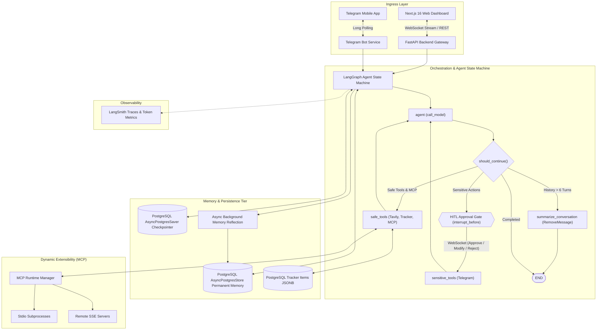

# J.A.R.V.I.S. (Just A Rather Very Intelligent System)

[](LICENSE)
[](https://www.python.org/)
[](https://fastapi.tiangolo.com/)
[](https://github.com/langchain-ai/langgraph)
[](https://nextjs.org/)
[](https://www.postgresql.org/)
[](https://modelcontextprotocol.io/)

A full-stack, autonomous personal assistant and agentic AI system engineered with **LangGraph**, **FastAPI**, **Next.js**, and **PostgreSQL**. Demonstrates production AI system design including **Model Context Protocol (MCP)** dynamic runtime integration, **Human-in-the-Loop (HITL)** approval workflows, **dual-layer memory architectures**, and **deterministic SQL analytics offloading**.

---

## 🏛️ System Architecture



---

## 🌟 Core AI Engineering Highlights

### 1. Stateful Multi-Turn Agent Workflows
Compiled using **LangGraph** with typed state management (`AgentState`), asynchronous nodes, and persistent conversation checkpointing via `AsyncPostgresSaver`. Multi-turn context is preserved across restarts and server instances.

### 2. Dual-Layer Memory Architecture
- **Short-Term Context Compaction**: Automatically identifies long conversation threads and uses `RemoveMessage` to prune older dialogue turns while synthesizing a consolidated context summary injected into the system prompt.
- **Long-Term Preference Reflection**: An asynchronous background task analyzes recent dialogue and uses LLM structured outputs (via Pydantic `MemoryUpdates`) to autonomously extract, upsert, or delete persistent user facts (name, tech stack, preferences) stored in PostgreSQL.

### 3. Model Context Protocol (MCP) Dynamic Runtime
Full implementation of the **Model Context Protocol (MCP)** specification:
- Connects to local **`stdio` subprocesses** (e.g. filesystem tools, git servers) and remote **`sse` streaming servers**.
- Dynamically converts MCP JSON Schemas into runtime Pydantic models with dynamic LangChain `BaseTool` wrappers.
- Hot-reload, connect, disconnect, and inspect tools at runtime via dedicated REST endpoints and UI modals without restarting the backend.

### 4. Human-in-the-Loop (HITL) Execution Safety Gate
Sensitive side effects (such as sending messages to Telegram) are routed to a dedicated `sensitive_tools` node configured with `interrupt_before=["sensitive_tools"]`:
- Graph execution halts before the action is executed.
- The web interface displays an interactive approval modal.
- The user can **Approve**, **Modify the draft payload in-place**, or **Reject** the action before resuming state.

### 5. Deterministic Math & Analytics Offloading
Eliminates LLM arithmetic hallucination by instructing the agent to delegate math, expense tracking, and category breakdowns directly to PostgreSQL native aggregate queries (`SUM`, `AVG`, `COUNT`, `MIN`, `MAX`) executing over indexed `JSONB` data.

### 6. Bidirectional Telegram Gateway
Two-way interaction allowing users to converse with J.A.R.V.I.S., query tracker databases, log expenses, and receive scheduled reminder alerts directly on mobile via Telegram.

---

## ⚡ Quickstart with Docker Compose

The fastest way to launch the entire stack (Frontend, Backend, and PostgreSQL with pgvector):

```bash
# 1. Clone the repository
git clone https://github.com/acedehra/jarvis.git
cd jarvis

# 2. Configure environment
cp backend/.env.example backend/.env
# Add your GEMINI_API_KEY (or other provider keys) in backend/.env

# 3. Start all services
docker compose up --build
```

- **Frontend Web UI**: [http://localhost:3000](http://localhost:3000)
- **Backend API & Swagger Docs**: [http://localhost:8000/docs](http://localhost:8000/docs)
- **PostgreSQL Database**: `localhost:5432`

---

## 🛠️ Local Development Setup

To run services natively in development mode:

### 1. Prerequisites
- **Python**: `>=3.13` (managed via [`uv`](https://docs.astral.sh/uv/))
- **Node / Runtime**: [`bun`](https://bun.sh/) (`>=1.0`)
- **PostgreSQL**: `>=16` (local or via Docker)

### 2. Backend Setup
```bash
cd backend
cp .env.example .env

# Sync Python dependencies
uv sync

# Start the FastAPI dev server with auto-reload
uv run uvicorn app.main:app --host 0.0.0.0 --port 8000 --reload
```

### 3. Frontend Setup
```bash
cd frontend

# Install dependencies
bun install

# Start Next.js dev server
bun run dev
```

---

## 📁 Repository Structure

```
.
├── backend/                      # FastAPI & LangGraph AI Service
│   ├── app/
│   │   ├── api/                  # REST API routes (MCP, Telegram, Tracker)
│   │   ├── core/                 # Config & PostgreSQL connection pools
│   │   ├── services/             # Graph, LLM, MCP, Memory, Tools, Tracker
│   │   └── main.py               # FastAPI lifespan & WebSocket streaming
│   ├── Dockerfile
│   ├── pyproject.toml            # UV dependencies
│   └── README.md                 # Backend technical guide
├── frontend/                     # Next.js 16 Web Dashboard
│   ├── app/                      # React 19 App Router & Modals
│   ├── Dockerfile
│   ├── package.json              # Bun packages
│   └── README.md                 # Frontend technical guide
├── .github/workflows/            # CI/CD Workflows (Docker GHCR Publish)
├── docker-compose.yml            # Local development compose
├── docker-compose.prod.yml       # Production multi-container compose
├── LICENSE                       # MIT Open Source License
└── README.md                     # Monorepo architecture & quickstart
```

---

## 🔒 Security & Privacy

- **Sandboxed Workspace Tools**: Inspection tools (`read_workspace_file`, `search_workspace_content`, `list_workspace_files`) are strictly sandboxed and forbidden from reading `.env` files, certificates, private keys, or credential configurations.
- **Configurable CORS**: Strict origin whitelisting configured via `CORS_ORIGINS`.
- **Telegram Access Control**: Bot commands and chat interactions can be locked to specific verified user chat IDs (`TELEGRAM_CHAT_ID`).

---

## 📄 License

This project is licensed under the [MIT License](LICENSE).
