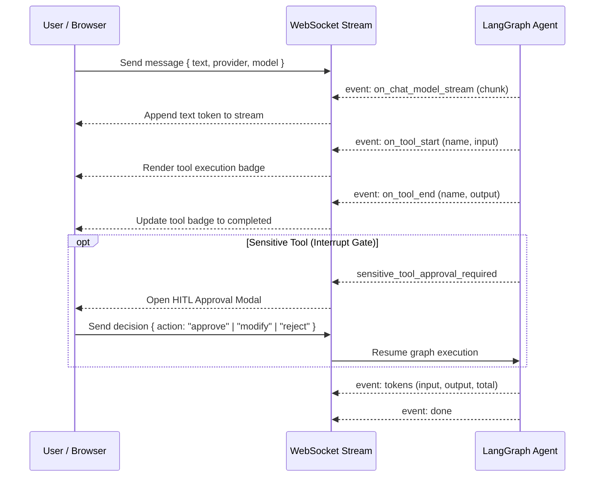

# J.A.R.V.I.S. Frontend

Modern, responsive web interface for the J.A.R.V.I.S. AI Assistant built with **Next.js** (App Router), **React 19**, **Tailwind CSS v4**, and **Bun**.

---

## 🌟 Key Features

- **Real-Time Token Streaming**: Streams agent responses character-by-character over WebSockets with auto-scrolling and connection resilience.
- **Dynamic Provider & Model Selection**: Switch seamlessly between Google Gemini, OpenAI, Anthropic Claude, and OpenRouter without page reloads.
- **Interactive Tool Execution Cards**: Visual expansion panels displaying live tool input arguments, execution status, and formatted output payloads.
- **Human-in-the-Loop (HITL) Authorization Dialog**: Interactive modal that pauses chat execution when sensitive tools (such as Telegram message dispatch) are invoked, allowing users to **Approve**, **Modify message content inline**, or **Reject**.
- **Model Context Protocol (MCP) Dashboard**: Full visual management UI for adding, inspecting, reconnecting, and removing stdio and SSE MCP servers at runtime.
- **Universal Structured Tracker**: Visual data management for logged expenses, to-dos, reminders, and bookmarks with category filtering and instant SQL aggregations.
- **Telegram Bot Control Center**: Direct status monitoring and test notification dispatch to verified Telegram chats.
- **Thread Management & Local Persistence**: Multiple conversation threads persisted in `localStorage` with automated database checkpointer cleanup upon deletion.
- **Markdown & Syntax Highlighting**: Rich rendering with GitHub Flavored Markdown (tables, task lists, blockquotes) and custom code block copy buttons.

---

## 📁 Directory Structure

```
frontend/
├── app/
│   ├── components/
│   │   ├── McpManagementModal.tsx  # Dynamic MCP server configuration & tool inspector modal
│   │   ├── TelegramModal.tsx       # Telegram bot connection status & test dispatch modal
│   │   └── TrackerModal.tsx        # Universal tracker management & analytics modal
│   ├── types/
│   │   └── api.ts                  # Auto-generated OpenAPI TypeScript definitions
│   ├── favicon.ico                 # App icon
│   ├── globals.css                 # Tailwind CSS v4 design tokens & theme setup
│   ├── layout.tsx                  # Root HTML layout and metadata
│   └── page.tsx                    # Main chat interface, WebSocket state, & streaming handler
├── Dockerfile                      # Production Next.js container configuration
├── package.json                    # Bun dependencies and scripts
└── tsconfig.json                   # TypeScript compiler configuration
```

---

## 🚀 Getting Started

### Prerequisites
- [`bun`](https://bun.sh/) (`>=1.0`)

### 1. Install Dependencies
```bash
bun install
```

### 2. Configure Environment (Optional)
By default, the frontend connects to `http://localhost:8000`. If running the backend on a different host/port, create a `.env.local` file:
```env
NEXT_PUBLIC_API_URL=http://localhost:8000
```

### 3. Start Development Server
```bash
bun run dev
```

The frontend will be available at **[http://localhost:3000](http://localhost:3000)**.

### 4. Production Build
```bash
bun run build
bun run start
```

---

## 🔄 WebSocket Event Protocol

The frontend communicates with the FastAPI backend over `/api/chat?session_id={thread_id}`:


